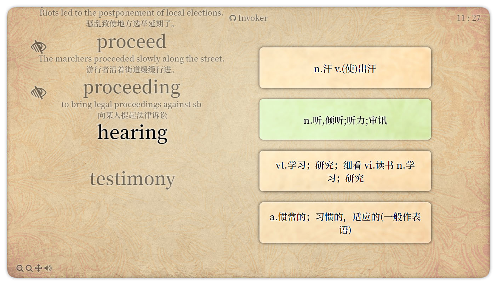

# Invoker: 用word2vec背誦單詞！

## 簡介

在傳統的記單詞app中，往往使用簡單的隨機算法抽取單詞。  
我覺得這很不科學，混亂的單詞順序會加重學習者的記憶負擔。

Invoker使用了word2vec模型抽取單詞。  
使用Invoker，近義詞會儘可能連續出現，學習者具有很高的效率，可以在短時間內記憶大量單詞。

## 對比

| 隨機抽取             | 用word2vec抽取         |
| ---------------- | ------------------- |
| `abandon vt.放弃`  | `abandon vt.放弃`     |
| `effort n.努力`    | `reject v.拒绝`       |
| `affluent a.富裕的` | `accept vt.接受`      |
| `journal n.定期刊物` | `acknowledge vt.承认` |
| `pole n.柱`       | `recognize v.认出`    |
| `fiction n.虚构`   | `understand v.懂`    |
| `tolerance n.宽容` | `comprehend vt.理解`  |

看起來word2vec抽取的有連續性，比較好背。

## 使用截图

## 使用方法

去 [github release](https://github.com/RimoChan/Invoker/releases) ，下載打包exe版本使用，很方便。

如果你對exe有偏見，也可以: 
    
1. 安裝python3.6以上版本
2. pip install wxpython cefpython3 numpy
3. python3 invoker.py

## 關於命名

祈求者Invoker是Dota2中的英雄，他是遠古時代最偉大的魔法使、記憶天賦最高的人。

祈求者的法術並非像其他英雄一樣相互獨立。  
他的法術可以分解爲 `冰`、`雷`、`火` 三個單位向量，向量的線性組合可以得到不同的法術。  
比如法術 `陽炎衝擊` 由3個 `火` 組成，如果把其中的一個 `火` 換成 `雷` ，得到和 `陽炎衝擊` 相似但又有些不同的法術 `混沌隕石` 。
